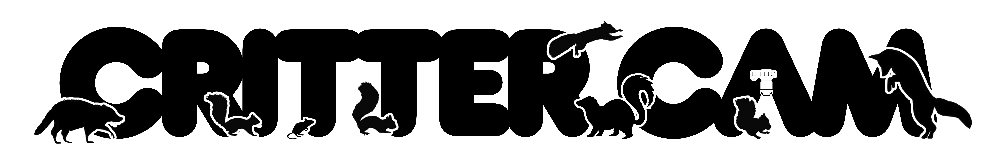

Backyard wildlife camera trap pipeline for ingestion, species identification, and local dashboard.

This is a fun DIY project - for serious camera trap software, see [AddaxAI](https://addaxdatascience.com/addaxai/).

## Setup

### 1. Create a conda environment

```bash
conda create -n crittercam python=3.12
conda activate crittercam
```

### 2. Install the package

From the repo root:

```bash
pip install -e ".[dev]"
```

The `-e` flag installs in editable mode so code changes take effect immediately without reinstalling.

### 3. Run the tests

```bash
pytest
```

### 4. Configure crittercam

Run the setup command to set the data root (where images and the database will be stored) and initialise the database:

```bash
crittercam setup
```

You will be prompted for:
- **Data root** — path to your external drive; images and the database are stored here
- **Country code** — ISO 3166-1 alpha-3 code (e.g. `USA`) for SpeciesNet geofencing; improves accuracy by filtering out species that don't occur in your region
- **State/province** — abbreviation (e.g. `CT`) for finer-grained geofencing

The config is written to `~/.config/crittercam/config.toml` and can be updated by running `crittercam setup` again.

### 5. Install Node.js (for the web dashboard)

The dashboard frontend requires Node.js. Install it via conda:

```bash
conda install -n critter -c conda-forge nodejs
```

Verify the install:

```bash
node --version   # should print v20 or later
npm --version
```

### 6. Install frontend dependencies

From the repo root:

```bash
npm --prefix crittercam/web/ui install
```

This downloads the React and Vite packages into `crittercam/web/ui/node_modules/`. Only needed once (and again after pulling changes that update `package.json`).

### 7. Install honcho (dev process manager)

```bash
pip install honcho
```

Honcho reads `Procfile.dev` and starts the API server and Vite dev server together with one command.

---

## Usage

### Ingest images

After offloading your SD card to a local directory, run:

```bash
crittercam ingest --source /path/to/offloaded/images
```

To override the configured data root for a single run:

```bash
crittercam ingest --source /path/to/offloaded/images --data-root /path/to/data
```

### Classify images

After ingesting, run species classification on all pending images:

```bash
crittercam classify
```

On first run, SpeciesNet will automatically download model weights (~1 GB) from Kaggle — no separate download step or credentials are required. 
Subsequent runs use the cached weights.

Each image produces:
- A detection row in the database with species label, confidence score, and bounding box
- A thumbnail at `derived/YYYY/MM/DD/<filename>_thumb.jpg`
- A padded crop at `derived/YYYY/MM/DD/<filename>_det001.jpg` (if an animal was detected)

**Overrides** — geofencing and crop padding can be adjusted per-run without changing the config:

```bash
crittercam classify --country USA --admin1-region CT --crop-padding 0.20
```

### Run the dashboard

**Development** (hot-reloading UI, recommended while building):

```bash
honcho start -f Procfile.dev
```

This starts two processes simultaneously:
- FastAPI/Uvicorn on `http://localhost:8000` — the API
- Vite on `http://localhost:5173` — the UI (visit this in the browser)

Vite automatically forwards `/api/*` and `/media/*` requests to the FastAPI server, so the browser only needs to know about port 5173.

**Production** (single server, requires a one-time UI build):

```bash
crittercam build-ui   # compiles the React app into crittercam/web/ui/dist/
crittercam serve      # serves API + built UI from a single Uvicorn process
```

Then visit `http://localhost:8000`.
