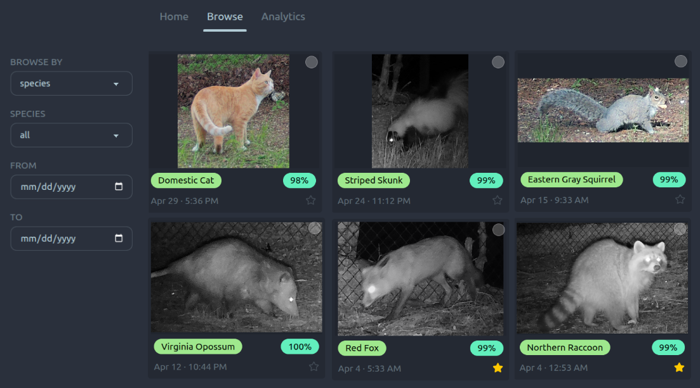

[//]: # (Backyard wildlife camera trap pipeline for ingestion, species identification, individual re-identification, and local dashboard.)

<h3 align="center">Backyard wildlife camera trap pipeline for ingestion, species identification, individual re-identification, and local dashboard</h3>

<div align="center">
  
</div>

This is a fun DIY project - for serious camera trap software with similar objectives, see [AddaxAI](https://addaxdatascience.com/addaxai/).

See [CONTRIBUTING.md](CONTRIBUTING.md) for environment setup.

---

## Setup

Run the setup command to set the data root (where images and the database will be stored) and initialise the database:

```bash
crittercam setup
```

You will be prompted for:
- **Data root** — path to your external drive; images and the database are stored here
- **Country code** — ISO 3166-1 alpha-3 code (e.g. `USA`) for SpeciesNet geofencing; improves accuracy by filtering out species that don't occur in your region
- **State/province** — abbreviation (e.g. `CT`) for finer-grained geofencing

The config is written to `~/.config/crittercam/config.toml` and can be updated by running `crittercam setup` again.

---

## Usage

### Ingest images

After offloading your SD card to a local directory, run:

```bash
crittercam ingest --source /path/to/offloaded/images
```

If `--deployment-id` is not supplied, an interactive prompt lists your existing deployments
and offers to create a new one. When creating a new deployment, camera make and model are
pre-filled from the EXIF data of the first image in the source directory.

To skip the prompt by specifying a deployment directly:

```bash
crittercam ingest --source /path/to/offloaded/images --deployment-id 1
```

To override the configured data root for a single run:

```bash
crittercam ingest --source /path/to/offloaded/images --data-root /path/to/data
```

### Classify images

After ingesting, run species classification on all pending images:

```bash
crittercam classify
```

On first run, SpeciesNet will automatically download model weights (~1 GB) from Kaggle — no separate download step or credentials are required.
Subsequent runs use the cached weights.

Each image produces:
- A detection row in the database with species label, confidence score, and bounding box
- A thumbnail at `derived/YYYY/MM/DD/<filename>_thumb.jpg`
- A padded crop at `derived/YYYY/MM/DD/<filename>_det001.jpg` (if an animal was detected)

**Overrides** — geofencing and crop padding can be adjusted per-run without changing the config:

```bash
crittercam classify --country USA --admin1-region CT --crop-padding 0.20
```

### Re-identify individuals

After classifying, run individual re-identification on all pending detections:

```bash
crittercam identify
```

On first run, MegaDescriptor-L-384 weights will download automatically from HuggingFace (~1.5 GB).
Subsequent runs use the cached weights.

For each detection crop, this computes an embedding vector and uses gallery-based nearest-neighbor
matching (cosine similarity) to assign detections to known individuals. New individuals are created
when no gallery match exceeds the threshold.

To target a single species:

```bash
crittercam identify --species "domestic cat"
```

To experiment with the similarity threshold without re-computing embeddings (fast — skips the model
entirely and just re-runs the matching step):

```bash
crittercam identify --skip-embedding --threshold 0.6
```

The default threshold is `0.5`, calibrated on domestic cat detections. Human-confirmed assignments
(merges, name corrections) are preserved as gallery anchors across re-matching runs.

**Merge individuals** that the algorithm split incorrectly — all reassigned detections are marked as
human-confirmed and will survive future re-matching. Individual IDs are shown in the dashboard
detail panel (click any crop to open it):

```bash
crittercam merge-individuals 3 7 12   # merges #7 and #12 into #3 (the lowest id)
```

**Name an individual** to give it a display nickname in the dashboard:

```bash
crittercam name-individual 3 "Mittens"
```

### Run the dashboard

```bash
crittercam build-ui   # compiles the React app into crittercam/web/ui/dist/
crittercam serve      # serves API + built UI from a single Uvicorn process
```

Then visit `http://localhost:8000`. See [CONTRIBUTING.md](CONTRIBUTING.md) for the hot-reloading dev server setup.
